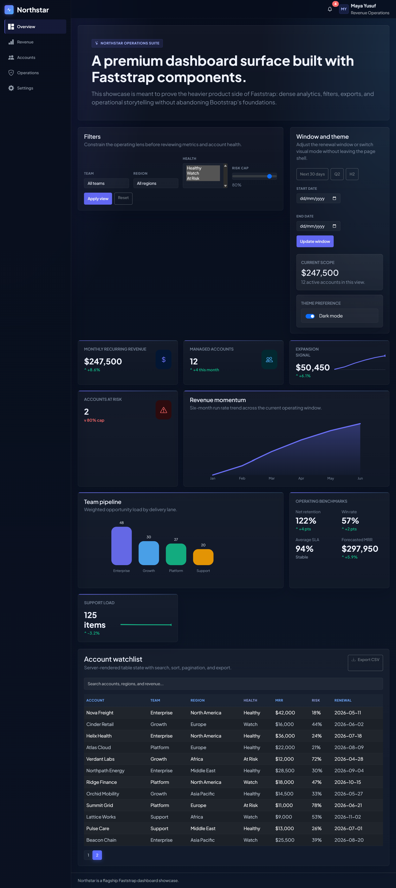

# FastStrap

**Modern Bootstrap 5 components for FastHTML - Build beautiful web UIs in pure Python with zero JavaScript knowledge.**

[](https://opensource.org/licenses/MIT)
[](https://www.python.org/downloads/)
[](https://fastht.ml/)
[](https://pypi.org/project/faststrap/)
[](https://github.com/Faststrap-org/Faststrap/actions)

---

## Why FastStrap

FastHTML is amazing for building web apps in pure Python, but it lacks pre-built UI components. FastStrap fills that gap by providing:


 **160+ components, helpers, and presets** - 143 registered UI components plus HTMX, SEO, PWA, and optional integrations
 **HTMX Presets Module** - 17 ready-to-use patterns for common interactions  
 **SEO Module** - Comprehensive meta tags, Open Graph, Twitter Cards, and structured data  
 **Zero JavaScript knowledge required** - Components just work  
 **No build steps** - Pure Python, no npm/webpack/vite  
 **Full HTMX integration** - Dynamic updates without page reloads  
 **Zero-JS animations by default** - Beautiful effects with pure CSS (`Fx`), with optional GSAP motion via `faststrap[gsap]`  
 **Dark mode built-in** - Automatic theme switching  
 **Type-safe** - Full type hints for better IDE support  
 **Pythonic API** - Intuitive kwargs style  
 **Enhanced customization** - Slot classes, CSS variables, themes, and more  
 **Docs and examples included** - Coverage is expanding

It also ships higher-level modules for HTMX presets, SEO metadata composition, and PWA setup so production concerns are covered alongside UI components.

---

## Quick Start

### Installation

```bash
pip install faststrap
```

### Hello World

```python
from fasthtml.common import FastHTML, serve
from faststrap import add_bootstrap, Card, Button, create_theme

app = FastHTML()

# Use built-in theme or create custom
theme = create_theme(primary="#7BA05B", secondary="#48C774")
add_bootstrap(app, theme=theme, mode="dark")

@app.route("/")
def home():
    return Card(
        "Welcome to FastStrap! Build beautiful UIs in pure Python.",
        header="Hello World!",
        footer=Button("Get Started", variant="primary")
    )

serve()
```

That's it! You now have a modern, responsive web app with zero JavaScript.

### Working with Static Files

Faststrap V0.5.1+ includes a helper to easily mount your own static files (images, CSS, etc.):

```python
from faststrap import mount_assets

# Mount your "assets" directory at "/assets" URL
mount_assets(app, "assets")

# Use in your app
Img(src="/assets/logo.png")
Div(style="background-image: url('/assets/hero.jpg')")
```

See [Static Files Guide](docs/STATIC_FILES.md) for more details.

---

## Enhanced Features

### 1. Enhanced Attribute Handling

Faststrap now supports advanced attribute handling:

```python
from faststrap import Button

# Style dict and CSS variables
Button(
    "Styled Button",
    style={"background-color": "#7BA05B", "border": "none"},
    css_vars={"--bs-btn-padding-y": "0.75rem", "--bs-btn-border-radius": "12px"},
    data={"id": "123", "type": "demo"},
    aria={"label": "Styled button"},
)

# Filter None/False values automatically
Button("Test", disabled=None, hidden=False)  # None/False values are dropped
```

### 2. CloseButton Helper

Reusable close button for alerts, modals, and drawers:

```python
from faststrap import CloseButton, Alert

# Use in alerts
Alert(
    "This alert uses CloseButton helper",
    variant="info",
    dismissible=True,
)

# Use in modals/drawers (automatically used)
```

### 3. Expanded Button Component

More control over button appearance and behavior:

```python
from faststrap import Button

# Render as link
Button("As Link", as_="a", href="/page", variant="secondary")

# Loading states with custom text
Button("Loading", loading=True, loading_text="Please wait...", spinner=True)

# Full width, pill, active states
Button("Full Width", full_width=True, variant="info")
Button("Pill", pill=True, variant="warning")
Button("Active", active=True, variant="success")

# Icon and spinner control
Button("Icon + Spinner", icon="check-circle", spinner=True, icon_pos="start")
```

### 4. Slot Class Overrides

Fine-grained control over component parts:

```python
from faststrap import Card, Modal, Drawer, Dropdown

# Card with custom slot classes
Card(
    "Content",
    header="Custom Header",
    footer="Custom Footer",
    header_cls="bg-primary text-white p-3",
    body_cls="p-4",
    footer_cls="text-muted",
)

# Modal with custom classes
Modal(
    "Modal content",
    title="Custom Modal",
    dialog_cls="shadow-lg",
    content_cls="border-0",
    header_cls="bg-primary text-white",
    body_cls="p-4",
)

# Drawer with custom classes
Drawer(
    "Drawer content",
    title="Custom Drawer",
    header_cls="bg-success text-white",
    body_cls="p-4",
)

# Dropdown with custom classes
Dropdown(
    "Option 1", "Option 2",
    label="Custom Dropdown",
    toggle_cls="custom-toggle",
    menu_cls="custom-menu",
    item_cls="custom-item",
)
```

### 5. Theme System

Create and apply custom themes:

```python
from faststrap import create_theme, add_bootstrap

# Create custom theme
my_theme = create_theme(
    primary="#7BA05B",
    secondary="#48C774",
    info="#36A3EB",
    warning="#FFC107",
    danger="#DC3545",
    success="#28A745",
    light="#F8F9FA",
    dark="#343A40",
)

# Use built-in themes
add_bootstrap(app, theme="green-nature")  # or "blue-ocean", "purple-magic", etc.

# Or use custom theme
add_bootstrap(app, theme=my_theme)
```

Available built-in themes:

- `green-nature`
- `blue-ocean`
- `purple-magic`
- `red-alert`
- `orange-sunset`
- `teal-oasis`
- `indigo-night`
- `pink-love`
- `cyan-sky`
- `gray-mist`

### 6. Registry Metadata And Discovery

Components include metadata about category, stability, and JavaScript requirements. The registry also helps developers and AI agents discover existing components before inventing new wrappers:

```python
from faststrap import (
    find_components,
    get_component,
    get_components_by_pattern,
    list_component_metadata,
    list_components,
)

components = list_components(category="display")
cards = find_components("card")
toast_components = get_components_by_pattern("toast")
metadata = list_component_metadata()

# Check if component requires JS
modal = get_component("Modal")
# Modal is registered with requires_js=True
```

---

## Available Components And Helpers (160+ Total)

Faststrap currently exposes **143 registered UI components** across forms, display, feedback, navigation, layout, and patterns, plus **17 HTMX presets**, SEO/PWA helpers, accessibility helpers, core utilities, and optional integrations. Components are typed, HTMX-friendly, and follow Bootstrap conventions. Stability markers (`@stable`, `@beta`, `@experimental`) indicate API maturity.

### Presets Module (17 Utilities)

- `ActiveSearch`
- `InfiniteScroll`
- `AutoRefresh`
- `LazyLoad`
- `LoadingButton`
- `OptimisticAction`
- `LocationAction`
- `hx_redirect`
- `hx_refresh`
- `hx_trigger`
- `hx_reswap`
- `hx_retarget`
- `toast_response`
- `SSEStream`
- `sse_event`
- `sse_comment`
- `@require_auth`

### Forms (35 Public Components / Helpers)

- `Button`
- `ButtonGroup`
- `ButtonToolbar`
- `CalendarDatePicker`
- `Checkbox`
- `CloseButton`
- `DateRangePicker`
- `ExportButton`
- `FileInput`
- `FilterBar`
- `FloatingActionButton`
- `FloatingLabel`
- `Form`
- `FormBuilder`
- `FormErrorSummary`
- `FormGroup`
- `FormGroupFromErrors`
- `FormWizard`
- `GradientButton`
- `Input`
- `InputGroup`
- `InputGroupText`
- `InlineEditor`
- `LiveValidationField`
- `MultiSelect`
- `Radio`
- `Range`
- `RangeSlider`
- `SearchableSelect`
- `Select`
- `Switch`
- `ThemeToggle`
- `ToggleGroup`
- `ValidationMessage`
- `WizardStep`

### Display (38 Components + 5 table aliases)

- `Avatar`
- `AvatarGroup`
- `Badge`
- `BadgeGroup`
- `Card`
- `Carousel`
- `CarouselItem`
- `Chart`
- `DataTable`
- `EmptyState`
- `Figure`
- `FlipCard`
- `GlowCard`
- `Image`
- `KPICard`
- `MapView`
- `Markdown`
- `Mermaid`
- `MetricCard`
- `ResultCard`
- `RevealCard`
- `Sheet`
- `SSETarget`
- `StatCard`
- `StatusBadge`
- `Stepper`
- `StepperStep`
- `Svg`
- `BsTable` / `BsTHead` / `BsTBody` / `BsTRow` / `BsTCell`
- `Table`
- `THead`
- `TBody`
- `TRow`
- `TCell`
- `TextClamp`
- `Timeline`
- `TimelineItem`
- `TiltCard`
- `TrendCard`

### v0.6.1 Naming Notes

- `FormBuilder` is now the preferred name for the Pydantic form builder API. If you are on `v0.6.0` or earlier, keep using `Form.from_pydantic()`. In `v0.6.1+`, prefer `FormBuilder.from_pydantic()`. `Form` remains as a compatibility alias.
- `Table`, `THead`, `TBody`, `TRow`, and `TCell` remain the primary table API. `v0.6.1` adds optional aliases `BsTable`, `BsTHead`, `BsTBody`, `BsTRow`, and `BsTCell` for projects that import both FastHTML and Faststrap table primitives.

### Feedback (35 Components)

- `Alert`
- `ConfirmAction`
- `ConfirmDialog`
- `DotsLoader`
- `ErrorDialog`
- `ErrorPage`
- `ErrorToast`
- `InfoToast`
- `InstallPrompt`
- `Modal`
- `ModernToast`
- `ModernToastStack`
- `NoticeAlert`
- `NoticeToast`
- `NotificationCenter`
- `Placeholder`
- `PlaceholderButton`
- `PlaceholderCard`
- `PolygonLoader`
- `Popover`
- `Progress`
- `ProgressBar`
- `ProgressRing`
- `PulseLoader`
- `RingLoader`
- `ShadowLoader`
- `SimpleToast`
- `Spinner`
- `SuccessToast`
- `Toast`
- `ToastContainer`
- `Tooltip`
- `TypewriterLoader`
- `WarningToast`
- `WaveLoader`

### Navigation (23 Components)

- `Accordion`
- `AccordionItem`
- `BottomNav`
- `BottomNavItem`
- `Breadcrumb`
- `Collapse`
- `CommandItem`
- `CommandPalette`
- `Drawer`
- `Dropdown`
- `DropdownDivider`
- `DropdownItem`
- `GlassNavbar`
- `GlassNavItem`
- `ListGroup`
- `ListGroupItem`
- `Navbar`
- `Pagination`
- `Scrollspy`
- `SidebarNavbar`
- `SidebarNavItem`
- `TabPane`
- `Tabs`

### Layout (6 Components)

- `Container`
- `Row`
- `Col`
- `Hero`
- `DashboardGrid`
- `ParallaxSection`

### Patterns (8 Composed Components)

- `Feature`
- `FeatureGrid`
- `FooterModern`
- `NavbarModern`
- `PricingGroup`
- `PricingTier`
- `Testimonial`
- `TestimonialSection`

### Layouts (3 Composed Layouts)

- `DashboardLayout`
- `LandingLayout`
- `AuthLayout`

### Accessibility (4 Helpers)

- `SkipLink`
- `LiveRegion`
- `VisuallyHidden`
- `FocusTrap`

### Effects (1 Module)

- `Fx` - Zero-JS animations and visual effects

### Optional Integrations (3 Opt-In Systems)

- `ChartJS` - Optional Chart.js integration via `faststrap[chartjs]`
- `Gsap` / `Motion` / `GsapReveal` - Optional GSAP motion integration via `faststrap[gsap]`
- `ModernToast` - Opinionated modern toast surface that remains separate from the core Bootstrap toast API

### Core Discovery And Theme Utilities

- `list_components`
- `get_component`
- `find_components`
- `get_components_by_pattern`
- `list_component_metadata`
- `theme_variant_css`

## Documentation Coverage

Docs are actively being expanded to match the full API surface. See the docs site and `examples/` for current coverage and usage patterns.

**View docs**: [https://faststrap-org.github.io/Faststrap/](https://faststrap-org.github.io/Faststrap/)

## Showcase References

Faststrap has a dedicated `showcase/` layer for polished, product-style references. These are fuller applications and landing pages, not tiny component demos.

| Reference | Best Use |
| --- | --- |
| `showcase/novaflow_ai_saas.py` | Premium SaaS landing pages |
| `showcase/atlas_command_center.py` | v0.7 command-center dashboard with new components |
| `showcase/onboardflow_workspace.py` | Workflow/onboarding apps with FormWizard and live validation |
| `showcase/northstar_ops_dashboard.py` | Dense analytics and operations dashboards |
| `showcase/hotel_booking_showcase.py` | Luxury/editorial product marketing |
| `showcase/ledgerleaf_finance.py` | Finance and mobile-aware account surfaces |

### Visual Preview




See the full gallery in the [Showcase docs](https://faststrap-org.github.io/Faststrap/showcase/).

---

## Examples

Comprehensive examples organized by learning path:

### 01_getting_started/

- `hello_world.py` - Your first Faststrap app
- `first_card.py` - Working with components
- `simple_form.py` - Building forms
- `adding_htmx.py` - HTMX interactivity

### 03_real_world_apps/

- `blog/` - Complete blog with posts, comments, admin
- `calculator/` - HTMX-powered calculator
- `game/` - Tic-tac-toe with win detection
- `ecommerce/` - E-commerce store (existing)

### 04_advanced/

- `effects_showcase.py` - All Faststrap effects demo
- `custom_themes.py` - Theme customization
- `component_defaults.py` - Global configuration

### 05_new_components/

- `v070_component_wave.py` - Core v0.7.0 component wave demo
- `v070_workflow_patterns.py` - HTMX workflow and helper patterns
- `v070_optional_integrations.py` - ModernToast, ChartJS, and GSAP opt-in integrations

**See**: `examples/README.md` for complete guide

---

## Current Release Snapshot

Faststrap's current main branch reflects the v0.7.x documentation and component wave:

- **143 registered UI components** across forms, display, feedback, navigation, layout, and patterns.
- **160+ total components, helpers, presets, and integrations** including HTMX presets, SEO helpers, PWA helpers, and optional integrations.
- **Optional integrations** for `faststrap[chartjs]`, `faststrap[gsap]`, and `faststrap[markdown]`.
- **Discovery APIs** including `list_components()`, `find_components()`, `get_components_by_pattern()`, and `list_component_metadata()`.
- **Documentation structure** with component index, architecture guide, upgrade guide, performance guide, and custom component guide.

Useful docs:

- [Component Index](https://faststrap-org.github.io/Faststrap/components/)
- [Architecture Guide](https://faststrap-org.github.io/Faststrap/guides/architecture/)
- [Performance Guide](https://faststrap-org.github.io/Faststrap/guides/performance/)
- [Upgrade Guide](https://faststrap-org.github.io/Faststrap/guides/upgrading/)

For the current source of truth on future build direction, see [`ROADMAP.md`](ROADMAP.md).

---

## Core Concepts

### 1. Adding Bootstrap to Your App

```python
from fasthtml.common import FastHTML
from faststrap import add_bootstrap, create_theme

app = FastHTML()

# Basic setup (includes default FastStrap favicon)
add_bootstrap(app)

# With dark mode
add_bootstrap(app, mode="dark")

# Custom theme
theme = create_theme(primary="#7BA05B", secondary="#48C774")
add_bootstrap(app, theme=theme)

# Using CDN
# Note: this covers Faststrap-managed assets only.
# Your own app CSS/images still need to be served by your deployment setup.
add_bootstrap(app, use_cdn=True)
```

### 2. Using Components

All components follow Bootstrap's conventions with Pythonic names:

```python
from faststrap import Button, Badge, Alert, Input, Select, Tabs

# Button with HTMX
Button("Save", variant="primary", hx_post="/save", hx_target="#result")

# Form inputs
Input("email", input_type="email", label="Email Address", required=True)
Select("country", ("us", "USA"), ("uk", "UK"), label="Country")

# Navigation tabs
Tabs(
    ("home", "Home", True),
    ("profile", "Profile"),
    ("settings", "Settings")
)
```

### 3. HTMX Integration

All components support HTMX attributes:

```python
# Dynamic button
Button("Load More", hx_get="/api/items", hx_swap="beforeend")

# Live search input
Input("search", placeholder="Search...", hx_get="/search", hx_trigger="keyup changed delay:500ms")

# Dynamic dropdown
Select("category", ("a", "A"), ("b", "B"), hx_get="/filter", hx_trigger="change")
```

### 4. Responsive Grid System

```python
from faststrap import Container, Row, Col

Container(
    Row(
        Col("Left column", cols=12, md=6, lg=4),
        Col("Middle column", cols=12, md=6, lg=4),
        Col("Right column", cols=12, md=12, lg=4)
    )
)
```

---

## Examples

### Form with Validation

```python
from faststrap import Input, Select, Button, Card

Card(
    Input(
        "email",
        input_type="email",
        label="Email Address",
        placeholder="you@example.com",
        required=True,
        help_text="We'll never share your email"
    ),
    Input(
        "password",
        input_type="password",
        label="Password",
        required=True,
        size="lg"
    ),
    Select(
        "country",
        ("us", "United States"),
        ("uk", "United Kingdom"),
        ("ca", "Canada"),
        label="Country",
        required=True
    ),
    Button("Sign Up", variant="primary", type="submit", cls="w-100"),
    header="Create Account"
)
```

### Navigation with Tabs

```python
from faststrap import Tabs, TabPane, Card

Card(
    Tabs(
        ("profile", "Profile", True),
        ("settings", "Settings"),
        ("billing", "Billing")
    ),
    Div(
        TabPane("Profile content here", tab_id="profile", active=True),
        TabPane("Settings content here", tab_id="settings"),
        TabPane("Billing content here", tab_id="billing"),
        cls="tab-content p-3"
    )
)
```

### Loading States

```python
from faststrap import Spinner, Progress, Button

# Spinner in button
Button(
    Spinner(size="sm", label="Loading..."),
    " Processing...",
    variant="primary",
    disabled=True
)

# Progress bar
Progress(75, variant="success", striped=True, animated=True, label="75%")

# Stacked progress
Div(
    ProgressBar(30, variant="success"),
    ProgressBar(20, variant="warning"),
    ProgressBar(10, variant="danger"),
    cls="progress"
)
```

### Pagination

```python
from faststrap import Pagination, Breadcrumb

# Breadcrumb
Breadcrumb(
    (Icon("house"), "/"),
    ("Products", "/products"),
    ("Laptops", None)
)

# Page navigation
Pagination(
    current_page=5,
    total_pages=20,
    size="lg",
    align="center",
    show_first_last=True
)
```

---

## Project Structure

```
faststrap/
 src/faststrap/               # Library source
    components/              # 143 registered UI components
    core/                    # Assets, theme, registry, discovery, base primitives
    integrations/            # Optional ChartJS and GSAP integrations
    presets/                 # HTMX interaction/response helpers
    seo/                     # SEO + structured data helpers
    pwa/                     # PWA manifest and install helpers
    layouts/                 # Composed page layouts
    static/                  # Vendored Bootstrap/Faststrap assets + favicon
 tests/                       # 779 collected tests in CI
 examples/                    # Structured examples by learning path
    01_getting_started/
    02_ui_components/
    03_real_world_apps/
    04_advanced/
 docs/                        # MkDocs site + guides (incl. deployment)
 pyproject.toml               # Packaging, tooling, and quality gates
```

---

## Development

### Prerequisites

- Python 3.10+
- FastHTML 0.6+
- Git

### Setup

```bash
# Clone repository
git clone https://github.com/Faststrap-org/Faststrap.git
cd Faststrap

# Create virtual environment
python -m venv .venv
source .venv/bin/activate  # Windows: .venv\Scripts\activate

# Install with dev dependencies
pip install -e ".[dev]"

# Run tests
pytest

# Run with coverage
pytest --cov=faststrap

# Type checking
mypy src/faststrap

# Format code
black src/faststrap tests
ruff check src/faststrap tests
```

---

## Troubleshooting

### Run Faststrap Doctor

Use `faststrap doctor` to catch common setup issues such as missing
`add_bootstrap()`, serverless asset-mode mismatches, or unsupported dependency
versions.

```bash
faststrap doctor
faststrap doctor --path .
```

### Static Files Not Loading (404 Errors)

**Fixed in v0.4.6+!** If you're seeing 404 errors for Bootstrap CSS/JS files, update to the latest version:

```bash
pip install --upgrade faststrap
```

### Theme Not Applied with fast_app()

When using `fast_app()`, add `data_bs_theme` to your root element:

```python
app, rt = fast_app()
add_bootstrap(app, mode="light")

@rt("/")
def get():
    return Div(
        YourContent(),
        data_bs_theme="light",  #  Add this for proper theming
    )
```

### Styles Not Loading with Custom Html()

When manually creating `Html()` + `Head()`, include `*app.hdrs`:

```python
@app.route("/")
def get():
    return Html(
        Head(
            Title("My App"),
            *app.hdrs,  #  Required for Faststrap styles
        ),
        Body(YourContent())
    )
```

**For more help**, see [TROUBLESHOOTING.md](docs/TROUBLESHOOTING.md)

---

## Contributing

We welcome contributions! See [CONTRIBUTING.md](CONTRIBUTING.md) for guidelines.

### Quick Contribution Guide

1. **Pick a component** from [ROADMAP.md](ROADMAP.md) active or planned sections
2. **Follow patterns** in [BUILDING_COMPONENTS.md](BUILDING_COMPONENTS.md)
3. **Write tests** - Aim for 100% coverage (8-15 tests per component)
4. **Submit PR** - We review within 48 hours

---

## Documentation

-  **Component Spec**: [COMPONENT_SPEC.md](COMPONENT_SPEC.md)
-  **Building Guide**: [BUILDING_COMPONENTS.md](BUILDING_COMPONENTS.md)
-  **Roadmap**: [ROADMAP.md](ROADMAP.md)
-  **Contributing**: [CONTRIBUTING.md](CONTRIBUTING.md)
-  **Changelog**: [CHANGELOG.md](CHANGELOG.md)

---

## Support

-  **Documentation**: [GitHub README](https://github.com/Faststrap-org/Faststrap#readme)
-  **Bug Reports**: [GitHub Issues](https://github.com/Faststrap-org/Faststrap/issues)
-  **Discussions**: [GitHub Discussions](https://github.com/Faststrap-org/Faststrap/discussions)
-  **Discord**: [FastHTML Community](https://discord.gg/qcXvcxMhdP)

---

## License

MIT License - see [LICENSE](LICENSE) file for details.

---

## Acknowledgments

- **FastHTML** - The amazing pure-Python web framework
- **Bootstrap** - Battle-tested UI components
- **HTMX** - Dynamic interactions without complexity
- **Contributors** - Thank you! 

---

**Built with  for the FastHTML community**


