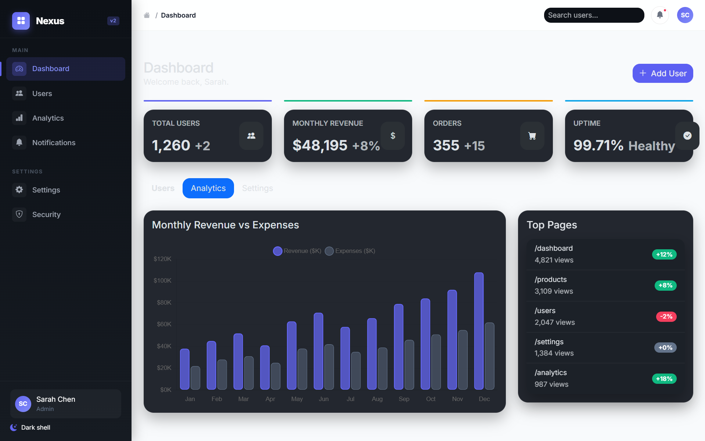

# Dashboard Showcases

Faststrap currently has two dashboard references with different roles.

## Primary Dashboard Reference

### Northstar Ops Dashboard

`showcase/northstar_ops_dashboard.py` is the main dashboard showcase and the stronger reference for modern operational UI.

It demonstrates:

- data-heavy page composition
- KPI cards and chart surfaces
- filtering and export flows
- theme-aware dashboard styling

## Legacy Dashboard Reference

### Admin Dashboard

`showcase/admin_dashboard.py` remains useful as an older, simpler dashboard example.

It is still helpful as a learning reference, but it is no longer the strongest guide for premium dashboard composition.

## Sources

- `showcase/northstar_ops_dashboard.py`
- `showcase/admin_dashboard.py`
