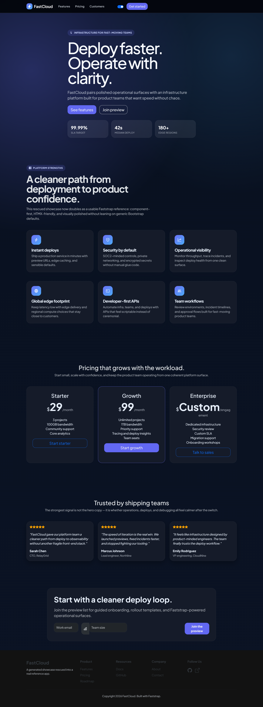

# FastCloud Generated SaaS

`showcase/fastcloud_generated_saas.py` is a compact landing-page showcase that demonstrates how far Faststrap can go without needing one of the largest flagship files.

It sits between tiny learning examples and the bigger flagship showcases: small enough to study quickly, but polished enough to feel like a real product surface.

## Gallery

## What It Shows

- a focused SaaS landing-page structure
- theme-aware presentation across light and dark modes
- Faststrap patterns such as `NavbarModern`, `FeatureGrid`, `PricingGroup`, and `TestimonialSection`
- HTMX-friendly feedback through `ToastContainer` and `toast_response`
- custom theme work and local CSS polish layered over Bootstrap-native structure

## Where It Fits

This showcase is a good reference when you want a page that is:

- easier to digest than the largest flagship SaaS examples
- still visually intentional and production-minded
- useful as a practical starting point for a landing page or marketing site

If you want the highest-end SaaS marketing reference in the current set, start with `showcase/novaflow_ai_saas.py`.

## Source

- `showcase/fastcloud_generated_saas.py`
