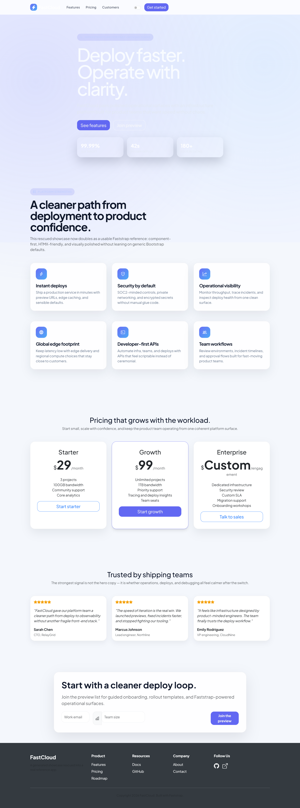
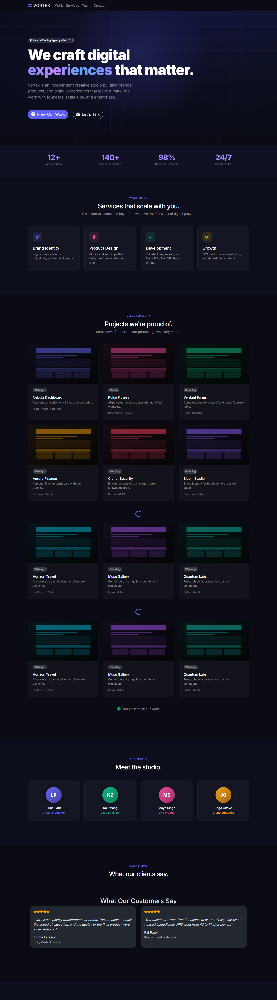

# Showcase Gallery

Faststrap keeps a dedicated `showcase/` layer for polished, production-style references.

These are not tiny component demos. They are fuller applications and landing pages meant to show what the framework looks like when the design system, layout, and interaction patterns are working together.

## Why The Showcase Layer Exists

The smaller examples in `examples/` are still useful for learning individual APIs, but they do not fully communicate the visual ceiling of the framework.

The showcase layer exists to highlight:

- premium landing pages
- dense internal dashboards
- vertical product applications
- polished client-facing websites

## Current Flagship Set

### Product and SaaS

- `showcase/novaflow_ai_saas.py`
- `showcase/fastcloud_generated_saas.py` as a rescued/minimal comparison point
- `showcase/saas_landing.py` as a legacy comparison point

### Dashboards and Data

- `showcase/northstar_ops_dashboard.py`
- `showcase/admin_dashboard.py` as a legacy dashboard comparison point
- `showcase/ledgerleaf_finance.py`

### Portfolio and Brand Sites

- `showcase/agency_portfolio.py`
- `showcase/lexbridge_corporate.py`

### Commerce and Hospitality

- `showcase/furniture_store_showcase.py`
- `showcase/hotel_booking_showcase.py`

### Vertical Product Apps

- `showcase/carenest_clinic.py`
- `showcase/learnloop_academy.py`
- `showcase/forgedocs_platform.py`

## Reference Quality Matrix

Use this table when choosing a reference to study first.

| Showcase | Role | Best Use |
| --- | --- | --- |
| `showcase/novaflow_ai_saas.py` | Flagship | Premium SaaS landing pages |
| `showcase/northstar_ops_dashboard.py` | Flagship | Analytics, operations, and internal dashboards |
| `showcase/hotel_booking_showcase.py` | Premium | Luxury, hospitality, and editorial product marketing |
| `showcase/ledgerleaf_finance.py` | Strong | Mobile-aware finance and account surfaces |
| `showcase/learnloop_academy.py` | Strong | Education and progress-driven product apps |
| `showcase/furniture_store_showcase.py` | Strong | Commerce and product storytelling |
| `showcase/agency_portfolio.py` | Strong | Brand-heavy portfolio and agency sites |
| `showcase/forgedocs_platform.py` | Strong | Documentation-oriented product shells |
| `showcase/carenest_clinic.py` | Acceptable | Healthcare and trust-heavy layouts |
| `showcase/fastcloud_generated_saas.py` | Rescued | Compact comparison example, not the premium default |
| `showcase/admin_dashboard.py` | Legacy | Simpler dashboard baseline and comparison |
| `showcase/saas_landing.py` | Legacy | Older SaaS baseline and comparison |

## Selected Gallery

### NovaFlow AI SaaS

### Northstar Ops Dashboard

### FastCloud Generated SaaS

### Agency Portfolio

## Screenshot Assets

Showcase screenshots live in:

- `docs/assets/showcase/`

That keeps the documentation pages, README, and future gallery updates aligned around one asset location.
