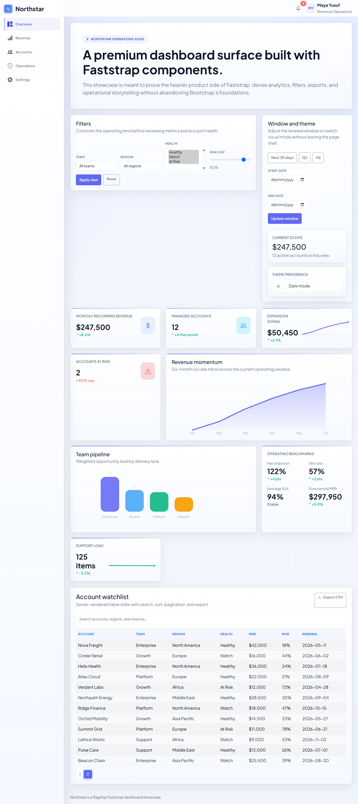

# Northstar Ops Dashboard

`showcase/northstar_ops_dashboard.py` is the flagship dashboard reference in Faststrap.

It is built to prove the heavier product side of the framework: dense information design, operational filtering, export flows, and data-oriented UI surfaces that still feel deliberate rather than generic.

## Gallery

## What It Shows

- `DashboardLayout` and `DashboardGrid`
- `MetricCard`, `TrendCard`, and `KPICard`
- `Chart` and `DataTable`
- filter controls such as `FilterBar`, `DateRangePicker`, `MultiSelect`, and `RangeSlider`
- `ExportButton`, `NotificationCenter`, and `ThemeToggle`
- a dashboard visual system that prioritizes clarity, hierarchy, and control density

## Why It Matters

Northstar is the best current reference for teams evaluating whether Faststrap can carry:

- internal tools
- admin surfaces
- reporting dashboards
- analytics-heavy product interfaces

## Source

- `showcase/northstar_ops_dashboard.py`
