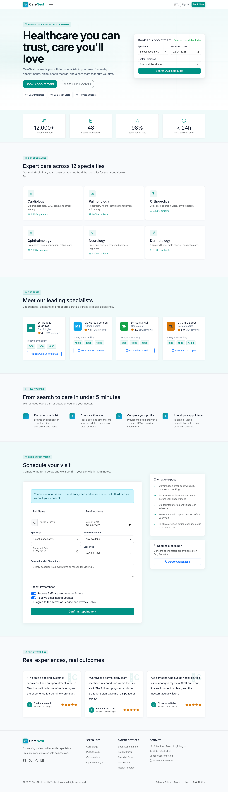
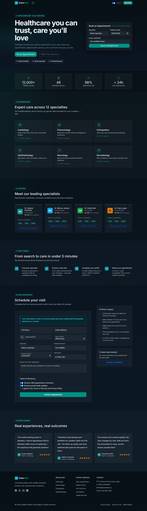
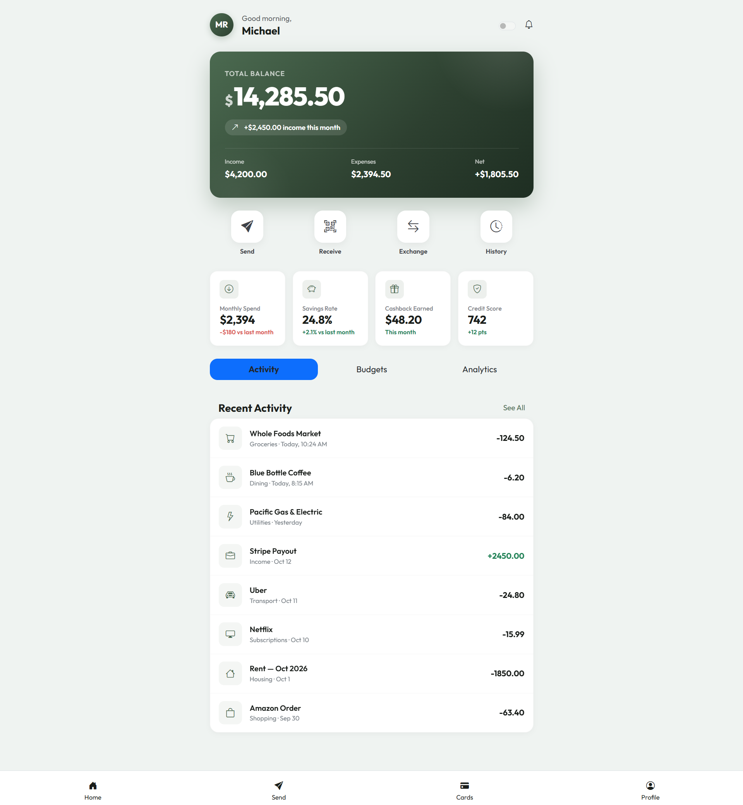
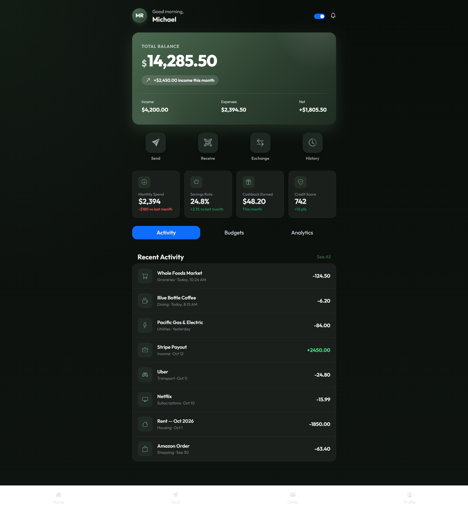
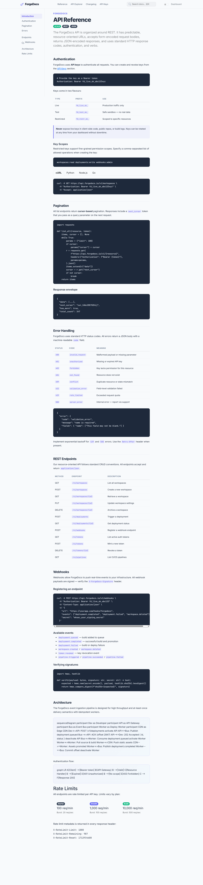
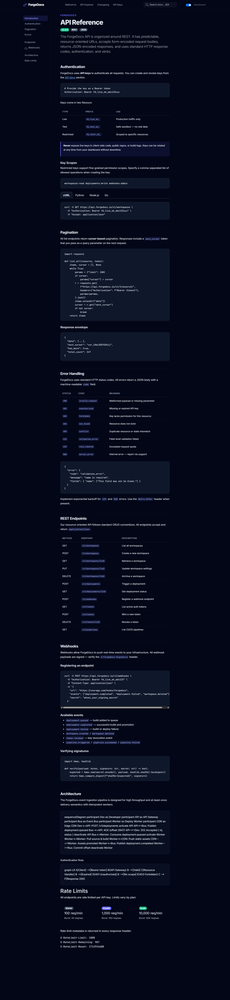

# Vertical Apps

Faststrap now includes several domain-specific showcases that demonstrate how the framework adapts across industries instead of only producing generic demos.

## Healthcare

### Carenest Clinic

`showcase/carenest_clinic.py` shows a healthcare-focused product surface with trust-heavy layout, appointment flows, and theme-aware styling.

## Finance

### LedgerLeaf Finance

`showcase/ledgerleaf_finance.py` demonstrates a finance-oriented product surface with mobile-aware navigation, data summaries, and denser operational cards.

## Education

### LearnLoop Academy

`showcase/learnloop_academy.py` shows how Faststrap can support course and progress-oriented product interfaces with a more energetic visual system.

## Corporate and Professional Services

### Lexbridge Corporate

`showcase/lexbridge_corporate.py` demonstrates a more restrained brand style suited to consulting, legal, and professional-service sites.

## Developer Tools and Docs

### ForgeDocs Platform

`showcase/forgedocs_platform.py` shows a developer-facing product surface with documentation-oriented layout and theme-aware UI treatment.

